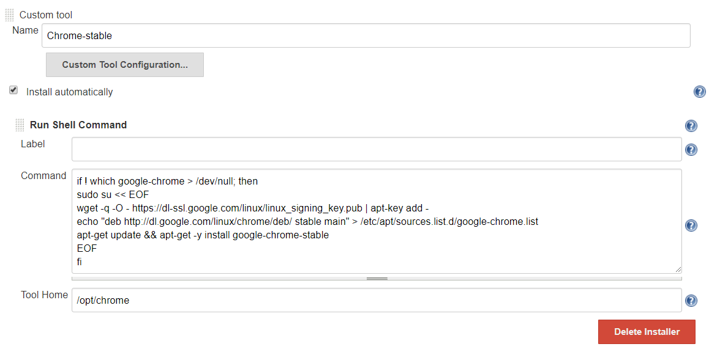
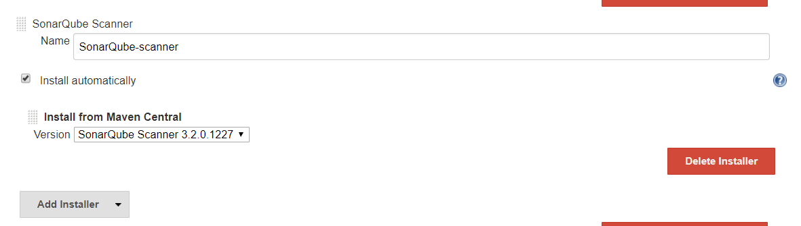
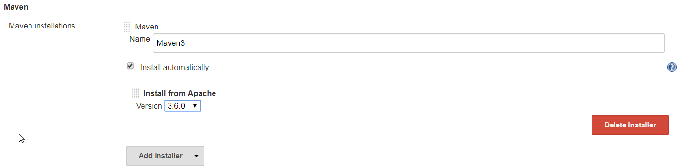
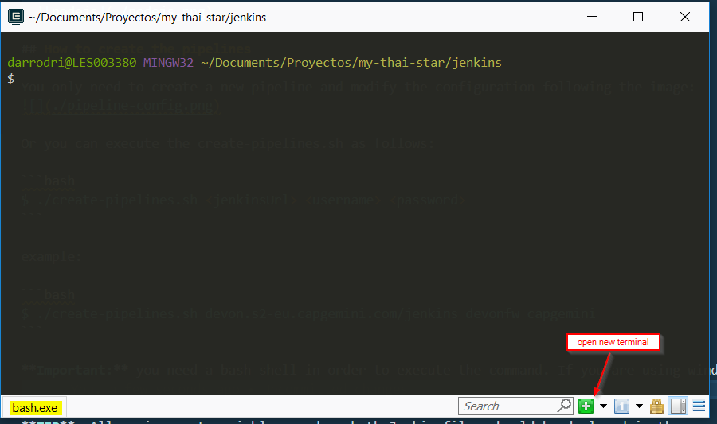

# Jenkins

In this folder 2 Jenkinsfile(s) are provided to execute some CI/CD process for different parts of the **My Thai Star** project. One for the **Angular client** and another one for the **Java server**. Both are intended to be executed in an already configured **Production Line instance**. This configuration is required to be **used by Devonfw projects**, and a guide can be found in the [**Devonfw Shop Floor** incubator's wiki](https://github.com/devonfw/devonfw-shop-floor/wiki/devonfw-shop-floor-4-production-line-environment).

## Installed plugins

In order to run all pipelines, we have installed the following plugins (maybe not all are required):

- **Pipeline Utility Steps (pipeline-utility-steps)**
- OWASP Markup Formatter Plugin (antisamy-markup-formatter)
- Office 365 Connector (Office-365-Connector)
- JavaScript GUI Lib: ACE Editor bundle plugin (ace-editor)
- Ant Plugin (ant)
- Apache HttpComponents Client 4.x API Plugin (apache-httpcomponents-client-4-api)
- Authentication Tokens API Plugin (authentication-tokens)
- Autofavorite for Blue Ocean (blueocean-autofavorite)
- Bitbucket Pipeline for Blue Ocean (blueocean-bitbucket-pipeline)
- Common API for Blue Ocean (blueocean-commons)
- Config API for Blue Ocean (blueocean-config)
- Blue Ocean Core JS (blueocean-core-js)
- Display URL for Blue Ocean (blueocean-display-url)
- Events API for Blue Ocean (blueocean-events)
- Git Pipeline for Blue Ocean (blueocean-git-pipeline)
- GitHub Pipeline for Blue Ocean (blueocean-github-pipeline)
- i18n for Blue Ocean (blueocean-i18n)
- JIRA Integration for Blue Ocean (blueocean-jira)
- JWT for Blue Ocean (blueocean-jwt)
- Personalization for Blue Ocean (blueocean-personalization)
- Pipeline implementation for Blue Ocean (blueocean-pipeline-api-impl)
- Blue Ocean Pipeline Editor (blueocean-pipeline-editor)
- Pipeline SCM API for Blue Ocean (blueocean-pipeline-scm-api)
- REST Implementation for Blue Ocean (blueocean-rest-impl)
- REST API for Blue Ocean (blueocean-rest)
- Web for Blue Ocean (blueocean-web)
- Blue Ocean (blueocean)
- bouncycastle API Plugin (bouncycastle-api)
- Branch API Plugin (branch-api)
- build-env-propagator (build-env-propagator)
- Build Timeout (build-timeout)
- Bitbucket Branch Source Plugin (cloudbees-bitbucket-branch-source)
- Folders Plugin (cloudbees-folder)
- Command Agent Launcher Plugin (command-launcher)
- Config File Provider Plugin (config-file-provider)
- Credentials Binding Plugin (credentials-binding)
- Credentials Plugin (credentials)
- **Custom Tools Plugin (custom-tools-plugin)**
- Deploy to container Plugin (deploy)
- disk-usage plugin (disk-usage)
- Display URL API (display-url-api)
- Docker Commons Plugin (docker-commons)
- Docker API Plugin (docker-java-api)
- Docker plugin (docker-plugin)
- Docker Pipeline (docker-workflow)
- Durable Task Plugin (durable-task)
- Email Extension Plugin (email-ext)
- EnvInject API Plugin (envinject-api)
- Environment Injector Plugin (envinject)
- Extended Choice Parameter Plug-In (extended-choice-parameter)
- External Monitor Job Type Plugin (external-monitor-job)
- Favorite (favorite)
- Gerrit Trigger (gerrit-trigger)
- GitHub Pull Request Builder (ghprb)
- Git client plugin (git-client)
- GIT server Plugin (git-server)
- Git plugin (git)
- GitHub API Plugin (github-api)
- GitHub Branch Source Plugin (github-branch-source)
- GitHub Integration Plugin (github-pullrequest)
- GitHub plugin (github)
- Gradle Plugin (gradle)
- JavaScript GUI Lib: Handlebars bundle plugin (handlebars)
- Handy Uri Templates 2.x API Plugin (handy-uri-templates-2-api)
- HTML Publisher plugin (htmlpublisher)
- Icon Shim Plugin (icon-shim)
- Jackson 2 API Plugin (jackson2-api)
- Javadoc Plugin (javadoc)
- Design Language (jenkins-design-language)
- JIRA plugin (jira)
- JavaScript GUI Lib: jQuery bundles (jQuery and jQuery UI) plugin (jquery-detached)
- jQuery UI plugin (jquery-ui)
- jQuery plugin (jquery)
- JSch dependency plugin (jsch)
- JUnit Plugin (junit)
- LDAP Plugin (ldap)
- Lockable Resources plugin (lockable-resources)
- Mailer Plugin (mailer)
- MapDB API Plugin (mapdb-api)
- Matrix Authorization Strategy Plugin (matrix-auth)
- Matrix Project Plugin (matrix-project)
- **Maven Integration plugin (maven-plugin)**
- Mercurial plugin (mercurial)
- JavaScript GUI Lib: Moment.js bundle plugin (momentjs)
- Multiple SCMs plugin (multiple-scms)
- **NodeJS Plugin (nodejs)**
- PAM Authentication plugin (pam-auth)
- Pipeline: Build Step (pipeline-build-step)
- Pipeline: GitHub (pipeline-github)
- Pipeline GitHub Notify Step Plugin (pipeline-githubnotify-step)
- Pipeline Graph Analysis Plugin (pipeline-graph-analysis)
- Pipeline: Input Step (pipeline-input-step)
- Pipeline Maven Integration Plugin (pipeline-maven)
- Pipeline: Milestone Step (pipeline-milestone-step)
- Pipeline: Model API (pipeline-model-api)
- Pipeline: Declarative Agent API (pipeline-model-declarative-agent)
- Pipeline: Declarative (pipeline-model-definition)
- Pipeline: Declarative Extension Points API (pipeline-model-extensions)
- Pipeline: REST API Plugin (pipeline-rest-api)
- Pipeline: Stage Step (pipeline-stage-step)
- Pipeline: Stage Tags Metadata (pipeline-stage-tags-metadata)
- Pipeline: Stage View Plugin (pipeline-stage-view)
- Plain Credentials Plugin (plain-credentials)
- pom2config (pom2config)
- Publish Over SSH (publish-over-ssh)
- Infrastructure plugin for Publish Over X (publish-over)
- Pub-Sub "light" Bus (pubsub-light)
- Purge Job History Plugin (purge-job-history)
- Resource Disposer Plugin (resource-disposer)
- Reverse Proxy Auth Plugin (reverse-proxy-auth-plugin)
- SCM API Plugin (scm-api)
- Selenium Plugin (selenium)
- SeleniumRC plugin (seleniumrc-plugin)
- **SonarQube Scanner for Jenkins (sonar)**
- Server Sent Events (SSE) Gateway Plugin (sse-gateway)
- SSH Agent Plugin (ssh-agent)
- SSH Credentials Plugin (ssh-credentials)
- SSH Slaves plugin (ssh-slaves)
- Structs Plugin (structs)
- Subversion Plug-in (subversion)
- Self-Organizing Swarm Plug-in Modules (swarm)
- Terminal Plugin (terminal)
- Timestamper (timestamper)
- Token Macro Plugin (token-macro)
- Variant Plugin (variant)
- VncRecorder Plugin (vncrecorder)
- Windows Slaves Plugin (windows-slaves)
- Pipeline (workflow-aggregator)
- Pipeline: API (workflow-api)
- Pipeline: Basic Steps (workflow-basic-steps)
- Pipeline: Shared Groovy Libraries (workflow-cps-global-lib)
- Pipeline: Groovy (workflow-cps)
- Pipeline: Nodes and Processes (workflow-durable-task-step)
- Pipeline: Job (workflow-job)
- Pipeline: Multibranch (workflow-multibranch)
- Pipeline: SCM Step (workflow-scm-step)
- Pipeline: Step API (workflow-step-api)
- Pipeline: Supporting APIs (workflow-support)
- Workspace Cleanup Plugin (ws-cleanup)
- Xvnc plugin (xvnc)
- Dashboard for Blue Ocean (blueocean-dashboard)
- Script Security Plugin (script-security)
- **HTTP Request Plugin (http_request)**

Most of them come pre-installed with the production line instance. The ones we need are the ones related to the pipeline and the ones in bold.

## Tools

- Java 8u192 JDK \
  
- Google Chrome Stable \
  
- SonarQube Scanner 3.2.0.1227 \
  
- Maven 3.6.0
  
- NodeJS 10.14.0 + yarn
  

## How to create the pipelines

You only need to create a new pipeline and modify the configuration following the image:


Or you can execute the create-pipelines.sh as follows:

```bash
$ ./create-pipelines.sh <jenkinsUrl> <username> <password>
```

example:

```bash
$ ./create-pipelines.sh devonfw.com/jenkins devonfw devonfw-password
```

**Important:** you need a bash shell in order to execute the command. If you are using windows, you can open a new bash shell in the devonfw console:

